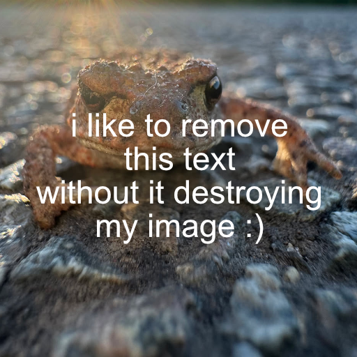
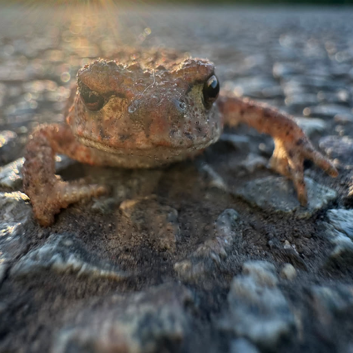

# Inpaint

Inpaint crate for image restoration and smooth interpolation of unknown values.

While inpainting is used for Images, this crate exposes its interface with [ndarrays](https://docs.rs/ndarray/latest/ndarray/).
Unlike OpenCV, any channel count and pixel type can be used.

The [Telea](./src/telea.rs) algorithm is ported from the [Pyheal](https://github.com/olvb/Pyheal) project, with some optimizations for Rust. With the Python bindings the same result can be achieved with this crate. In testing it is over 30x faster than Pyheal. The sample image takes `0.6` second in Pyheal, while in this crate it takes around `0.02` seconds on my machine.

Lets have this image of the toad I recently photographed. Unfortunately, some text has been burned into the image which I desperately want to remove:

| Damaged image           |  Mask                   |
|-------------------------|-------------------------|
|  |  |

---
Running this crate on the image returns this as the result:

| Result                  |
|-------------------------|
|  |

You can call this code yourself at `./examples/python/` or `./examples/rust/`.
```bash
cd examples/python && uv run main.py
```

```bash
cd examples/rust && cargo run --release
```


## Features
- Non-image support, so any array can be used as long as it is in the `ndarray` format.
- Traits for the `Image` crate as optional feature. Just call `.inpaint_telea()` method on your image and have it inpainted. Make sure the `image` feature is enabled in your `Cargo.toml`
- Python bindings to have the same functionality as Rust in Python.

## Examples

### Inpaint an ImageBuffer in Rust
You can also run the example in examples/simple. This will use the inpaint library and output the inpainted image as `output.png`.

```rust
use inpaint::prelude::*;
let mut image = image::open("./test/images/input/toad.png").unwrap().to_rgba32f();
let mask = image::open("./test/images/mask/text.png").unwrap().to_luma32f();

image.telea_inpaint(&mask, 3);
```

### Inpaint an image in Python
```python
import inpaint
from PIL import Image

image = Image.open("./test/images/input/toad.png")
mask = Image.open("./test/images/mask/text.png")

output = inpaint.telea(image, mask, 3)

output.save("./output.png")
```